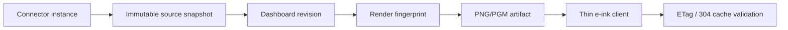

# Data Flow

Each layer keeps last-known-good output. Connector failures do not delete prior snapshots. Render failures do not delete prior artifacts. Device failures leave the previous screen in place.
