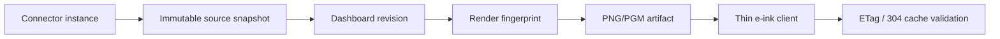

# Data Flow

Each layer keeps last-known-good output. Connector failures do not delete the latest successful snapshot. Render failures do not delete prior artifacts. Device failures leave the previous screen in place.

The server keeps `state.snapshots[sourceId]` as the current snapshot used for rendering and polling decisions. It also keeps a bounded `state.snapshotHistory[sourceId]` list for recent immutable snapshots, controlled by `retention.snapshotHistoryLimit` or `DASHBOARD_KINDLE_SNAPSHOT_HISTORY_LIMIT`. This preserves enough history for diagnostics, auditing, and future chart views without allowing unbounded state-file growth.
